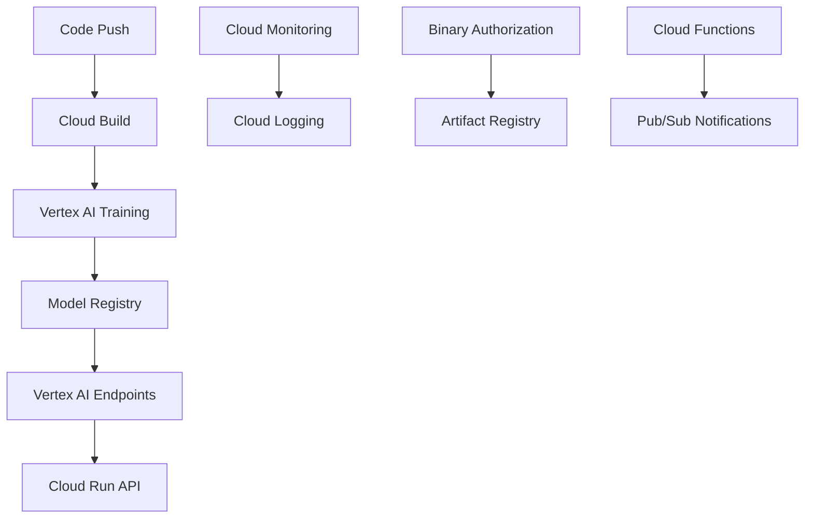

# 🔥 MLOps Niveau 2 avec Google Cloud

## 🚀 **MLOps Niveau 2 avec Google Cloud**

### Architecture GCP recommandée



### Services GCP utilisés

#### 1. **Vertex AI** (vs manuel)

```yaml
# ❌ Manuel dans GitHub Actions
- name: Train model
  run: python train.py

# ✅ Vertex AI Training
- name: Submit Vertex AI Job
  run: |
    gcloud ai custom-jobs create \
      --region=europe-west1 \
      --display-name="mnist-training" \
      --worker-pool-spec=machine-type=n1-standard-4
```

#### 2. **Cloud Build** (vs GitHub Actions)

```yaml
# Cloud Build pour optimiser les builds
steps:
- name: 'gcr.io/cloud-builders/docker'
  args: ['build', '-t', 'gcr.io/$PROJECT_ID/mnist:$BUILD_ID', '.']
- name: 'gcr.io/cloud-builders/docker'  
  args: ['push', 'gcr.io/$PROJECT_ID/mnist:$BUILD_ID']
```

#### 3. **Vertex AI Endpoints** (vs Cloud Run direct)

```python
# Déploiement automatique avec A/B testing
from google.cloud import aiplatform

endpoint = aiplatform.Endpoint.create(
    display_name="mnist-production"
)

# Traffic split automatique
endpoint.deploy(
    model=new_model,
    traffic_percentage=10,  # 10% nouveau modèle
    machine_type="n1-standard-2"
)
```

### Configuration requise

#### 1. **Secrets GitHub**

```bash
# Dans GitHub Settings > Secrets
GCP_PROJECT_ID=your-project-id
GCP_SA_KEY={"type": "service_account", ...}  # JSON key
```

#### 2. **Services GCP à activer**

```bash
gcloud services enable aiplatform.googleapis.com
gcloud services enable cloudbuild.googleapis.com
gcloud services enable run.googleapis.com
gcloud services enable artifactregistry.googleapis.com
gcloud services enable monitoring.googleapis.com
```

#### 3. **IAM Permissions**

```bash
# Service Account permissions
roles/aiplatform.admin
roles/run.admin
roles/storage.admin
roles/artifactregistry.admin
roles/monitoring.admin
```

### Avantages Google Cloud vs GitHub Actions

#### ✅ **Vertex AI Training**

- **Scalabilité** : GPU/TPU automatique
- **Experiment tracking** intégré
- **Hyperparameter tuning** automatique
- **Pipeline orchestration** native

#### ✅ **Model Registry**

- **Versioning** automatique
- **Lineage tracking** complet
- **Model metadata** riche
- **Approval workflows** intégrés

#### ✅ **Monitoring avancé**

- **Model drift** detection native
- **Explainability** intégrée
- **Fairness metrics** automatiques
- **Performance monitoring** temps réel

#### ✅ **Déploiement intelligent**

- **A/B testing** natif dans Vertex AI
- **Traffic splitting** automatique
- **Rollback** basé sur métriques
- **Auto-scaling** intelligent

### Migration step-by-step

#### 1. **Préparation**

```bash
# Créer le projet GCP
gcloud projects create mnist-mlops-project
gcloud config set project mnist-mlops-project

# Setup de base
gcloud auth application-default login
gcloud services enable aiplatform.googleapis.com
```

#### 2. **Conversion du training**

```python
# Remplacer train_model.py par Vertex AI
from google.cloud import aiplatform

job = aiplatform.CustomJob.from_local_script(
    display_name="mnist-training",
    script_path="src/train_model.py",
    container_uri="gcr.io/cloud-aiplatform/training/pytorch-gpu.1-13:latest",
    machine_type="n1-standard-4",
    accelerator_type="NVIDIA_TESLA_K80",
    accelerator_count=1
)

job.run()
```

#### 3. **Conversion du déploiement**

```python
# Remplacer docker deploy par Vertex AI Endpoint
model = aiplatform.Model.upload(
    display_name="mnist-model",
    artifact_uri="gs://your-bucket/model/",
    serving_container_image_uri="gcr.io/cloud-aiplatform/prediction/pytorch-gpu.1-13:latest"
)

endpoint = model.deploy(
    machine_type="n1-standard-2",
    min_replica_count=1,
    max_replica_count=10
)
```

### Workflow GCP complet

Le workflow `.github/workflows/mlops-gcp-level2.yml` utilise :

1. **Vertex AI Custom Jobs** pour training
2. **Artifact Registry** pour containers
3. **Cloud Run** pour API serving
4. **Vertex AI Endpoints** pour ML serving
5. **Cloud Monitoring** pour observabilité
6. **Binary Authorization** pour sécurité

### Next Steps

1. **Migrer vers Vertex AI** : Remplacer GitHub Actions training
2. **Setup Model Registry** : Versioning automatique
3. **Implement Pipelines** : Vertex AI Pipelines pour orchestration
4. **Add Feature Store** : Vertex AI Feature Store
5. **Setup Monitoring** : Model drift detection native

## 🚀 **Conclusion**

**GitHub Actions** = Bon pour débuter MLOps
**Google Cloud** = MLOps niveau enterprise avec Vertex AI

La migration te donnerait :

- **Scalabilité** illimitée
- **Monitoring** natif avancé
- **A/B testing** simplifié
- **Governance** enterprise
- **Coûts** optimisés pour production

**Recommandation** : Commencer par GitHub Actions (apprentissage), puis migrer vers GCP (production).
